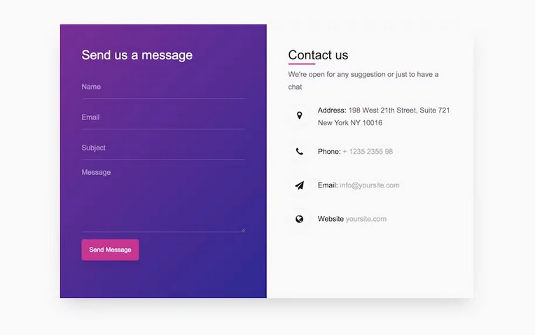

# Formular Styling - LÖSUNG mit flex

- schau dir das Mockup an und versuche es möglichst genau nachzubauen
- die Felder Email, Name und Subject sollten Pflichtfelder sein

*Bonus*
- versucht das im Namensfeld nur Buchstaben eingegeben werden können 

